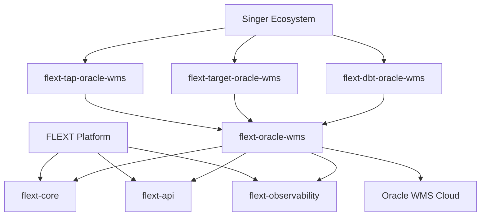

# FLEXT Oracle WMS - Enterprise Integration Library

[](https://www.python.org/downloads/)
[](https://www.oracle.com/scm/warehouse-management/)
[](https://github.com/flext-sh/flext)
[](https://pytest.org)
[](http://mypy-lang.org/)

**Enterprise Oracle WMS Cloud integration library for the FLEXT data integration platform.** Provides type-safe, async Oracle WMS REST API connectivity with comprehensive entity discovery, schema processing, and data operations support.

## 🏗️ FLEXT Ecosystem Position

flext-oracle-wms is an **Infrastructure Library** within the FLEXT ecosystem, serving as the specialized Oracle WMS Cloud integration layer. It builds upon FLEXT foundation patterns and integrates with the broader data pipeline ecosystem.

### Ecosystem Integration



## 🎯 Core Capabilities

### Oracle WMS Cloud Integration

- **REST API Connectivity**: Type-safe async HTTP client with retry logic and error handling
- **Entity Discovery**: Automatic discovery of WMS entities and schema information
- **Authentication**: Multiple auth methods (Basic, Bearer Token, API Key)
- **Performance Optimization**: Connection pooling, caching, and configurable batch operations

### FLEXT Foundation Integration

- **FlextResult Pattern**: Railway-oriented programming for consistent error handling
- **Structured Logging**: Correlation IDs, structured context, and enterprise logging standards
- **Configuration Management**: Environment-driven config with type validation
- **Dependency Injection**: Integration with flext-core DI container

### Data Pipeline Integration

- **Schema Processing**: Dynamic schema discovery and transformation
- **Singer Protocol Foundation**: Basic infrastructure for tap/target integration (development in progress)
- **Entity Discovery**: Automated Oracle WMS entity discovery and catalog generation

## 🏛️ Architecture Overview

### Clean Architecture Implementation

```
src/flext_oracle_wms/
├── client.py              # Primary WMS client interface
├── api_catalog.py         # Declarative API endpoint definitions
├── authentication.py      # Multi-method authentication system
├── config.py             # Pydantic configuration management
├── discovery.py          # Entity and schema discovery
├── cache.py              # Enterprise caching patterns
├── dynamic.py            # Dynamic schema processing
├── exceptions.py         # Comprehensive error hierarchy
└── models.py             # Data models and value objects
```

### Integration Layers

1. **API Client Layer**: HTTP communication with Oracle WMS Cloud
2. **Authentication Layer**: Enterprise auth patterns with multiple methods
3. **Discovery Layer**: Automatic entity and schema discovery
4. **Processing Layer**: Data transformation and flattening
5. **Caching Layer**: Performance optimization with intelligent caching

## 🚀 Quick Start

### Installation

```bash
# Install via Poetry (recommended for FLEXT ecosystem development)
poetry add flext-oracle-wms

# Or via pip
pip install flext-oracle-wms
```

### Basic Usage

```python
from flext_oracle_wms import FlextOracleWmsClient, FlextOracleWmsClientConfig
from flext_core import FlextResult

# Configure WMS connection
config = FlextOracleWmsClientConfig(
    base_url="https://your-wms-instance.oraclecloud.com",
    username="your_username",
    password="your_password"
)

# Initialize client with FLEXT patterns
client = FlextOracleWmsClient(config)

# All operations return FlextResult for type-safe error handling
entities_result: FlextResult = await client.discover_entities()
if entities_result.success:
    print(f"Discovered {len(entities_result.data)} WMS entities")
    for entity in entities_result.data:
        print(f"- {entity.name}: {entity.description}")
else:
    print(f"Discovery failed: {entities_result.error}")
```

### Advanced Configuration

```python
import os
from flext_oracle_wms import FlextOracleWmsClientConfig

# Environment-driven configuration (FLEXT standard)
config = FlextOracleWmsClientConfig(
    base_url=os.getenv("FLEXT_ORACLE_WMS_BASE_URL"),
    username=os.getenv("FLEXT_ORACLE_WMS_USERNAME"),
    password=os.getenv("FLEXT_ORACLE_WMS_PASSWORD"),
    auth_method="bearer",  # or "basic", "api_key"
    timeout=int(os.getenv("FLEXT_ORACLE_WMS_TIMEOUT", "30")),
    max_retries=int(os.getenv("FLEXT_ORACLE_WMS_MAX_RETRIES", "3")),
    cache_enabled=True
)

# Client with enhanced error handling
async def safe_wms_operation():
    result = await client.get_inventory_data("INVENTORY_ENTITY")

    if result.success:
        # Process inventory data
        inventory_data = result.data
        print(f"Retrieved {len(inventory_data)} inventory records")
        return inventory_data
    else:
        # Handle errors with FLEXT logging patterns
        logger.error(f"WMS operation failed: {result.error}")
        return []
```

## 🛠️ Development

### Quality Gates (Zero Tolerance)

```bash
# Complete validation pipeline (required before commits)
make validate              # Lint + type + security + test (90% coverage)

# Development workflow
make check                 # Quick validation (lint + type + test)
make test                  # Run test suite with coverage
make format                # Auto-format code with ruff

# Individual quality gates
make lint                  # Ruff linting (comprehensive rule set)
make type-check            # MyPy strict mode (zero errors tolerated)
make security              # Bandit + pip-audit security scanning
```

### FLEXT Development Standards

```bash
# Environment setup
make setup                 # Complete development setup with pre-commit hooks
make install               # Install dependencies with Poetry
make pre-commit            # Run pre-commit hooks

# Build and diagnostics
make build                 # Build package with Poetry
make diagnose              # System diagnostics (Python, Poetry, dependencies)
make deps-audit            # Security audit of dependencies
```

### Testing Strategy

```bash
# Test execution
make test                  # Full test suite with 90% coverage requirement
make test-unit             # Unit tests only
make test-integration      # Integration tests with real WMS systems
make coverage-html         # Generate HTML coverage report

# Advanced testing patterns
pytest tests/test_client.py -v                    # Test specific module
pytest -k "authentication" -v                     # Pattern-based test selection
pytest -m integration -v                          # Run integration tests only
pytest --lf                                       # Run only last failed tests
```

## 🔧 Configuration

### Environment Variables

```bash
# WMS connection settings
export FLEXT_ORACLE_WMS_BASE_URL="https://your-wms.oraclecloud.com"
export FLEXT_ORACLE_WMS_USERNAME="api_user"
export FLEXT_ORACLE_WMS_PASSWORD="secure_password"

# Authentication configuration
export FLEXT_ORACLE_WMS_AUTH_METHOD="basic"  # basic, bearer, api_key
export FLEXT_ORACLE_WMS_API_KEY="your_api_key"  # if using API key auth

# Performance and reliability
export FLEXT_ORACLE_WMS_TIMEOUT="30"
export FLEXT_ORACLE_WMS_MAX_RETRIES="3"
export FLEXT_ORACLE_WMS_POOL_SIZE="10"
export FLEXT_ORACLE_WMS_CACHE_TTL="300"

# FLEXT ecosystem integration
export FLEXT_LOG_LEVEL="info"
export FLEXT_ENABLE_METRICS="true"
export FLEXT_TRACE_REQUESTS="true"
```

### Docker Integration

```yaml
# docker-compose.yml
version: "3.8"
services:
  flext-oracle-wms:
    image: flext/oracle-wms:latest
    environment:
      - FLEXT_ORACLE_WMS_BASE_URL=${WMS_BASE_URL}
      - FLEXT_ORACLE_WMS_USERNAME=${WMS_USERNAME}
      - FLEXT_ORACLE_WMS_PASSWORD=${WMS_PASSWORD}
      - FLEXT_LOG_LEVEL=info
      - FLEXT_ENABLE_METRICS=true
    healthcheck:
      test:
        [
          "CMD",
          "python",
          "-c",
          "from flext_oracle_wms import health_check; health_check()",
        ]
      interval: 30s
      timeout: 10s
      retries: 3
    depends_on:
      - flext-core
      - flext-observability
```

## 📊 API Reference

### Core Client Interface

```python
from flext_oracle_wms import FlextOracleWmsClient, FlextOracleWmsClientConfig
from flext_core import FlextResult
from typing import List, Dict, Any

class FlextOracleWmsClient:
    """Enterprise Oracle WMS client with FLEXT integration."""

    def __init__(self, config: FlextOracleWmsClientConfig) -> None:
        """Initialize client with configuration."""

    async def discover_entities(self) -> FlextResult[List[WmsEntity]]:
        """Discover available WMS entities."""

    async def get_entity_schema(self, entity_name: str) -> FlextResult[Dict[str, Any]]:
        """Get schema for specific entity."""

    async def query_entity_data(
        self,
        entity_name: str,
        filters: Optional[Dict[str, Any]] = None
    ) -> FlextResult[List[Dict[str, Any]]]:
        """Query entity data with optional filters."""
```

### Configuration Management

```python
from flext_oracle_wms import FlextOracleWmsClientConfig
from pydantic import BaseModel

class FlextOracleWmsClientConfig(BaseModel):
    """Type-safe configuration with Pydantic validation."""

    base_url: str
    username: str
    password: str
    auth_method: str = "basic"
    timeout: int = 30
    max_retries: int = 3
    cache_enabled: bool = True
    cache_ttl: int = 300
```

### Error Handling

```python
from flext_oracle_wms.exceptions import (
    FlextOracleWmsError,
    FlextOracleWmsConnectionError,
    FlextOracleWmsAuthenticationError,
    FlextOracleWmsApiError
)

try:
    result = await client.discover_entities()
    if result.is_failure:
        # Handle business logic errors via FlextResult
        logger.error(f"WMS operation failed: {result.error}")
except FlextOracleWmsConnectionError as e:
    # Handle connection issues
    logger.error(f"Failed to connect to Oracle WMS: {e}")
except FlextOracleWmsAuthenticationError as e:
    # Handle authentication failures
    logger.error(f"WMS authentication failed: {e}")
```

## 🔗 FLEXT Ecosystem Integration

### Foundation Libraries

- **[flext-core](../flext-core)**: Base patterns, FlextResult, logging, dependency injection
- **[flext-api](../flext-api)**: Enterprise API client patterns and authentication
- **[flext-observability](../flext-observability)**: Monitoring, metrics, tracing, health checks

### Singer Ecosystem Integration

```python
from flext_oracle_wms import create_singer_catalog

# Generate Singer catalog for discovered entities
catalog = await create_singer_catalog(client)

# Use with FLEXT data pipelines
pipeline_config = {
    "tap": "flext-tap-oracle-wms",
    "target": "flext-target-oracle",
    "catalog": catalog,
    "config": {
        "base_url": "https://your-wms.oraclecloud.com",
        "username": "api_user",
        "password": "secure_password"
    }
}
```

### Data Pipeline Projects

- **[flext-tap-oracle-wms](../flext-tap-oracle-wms)**: Singer tap for Oracle WMS data extraction
- **[flext-target-oracle-wms](../flext-target-oracle-wms)**: Singer target for Oracle WMS data loading
- **[flext-dbt-oracle-wms](../flext-dbt-oracle-wms)**: DBT models for Oracle WMS data transformation

## 📈 Performance & Monitoring

### Built-in Observability

```python
from flext_oracle_wms import FlextOracleWmsClient
from flext_observability import flext_monitor_function

@flext_monitor_function("wms_inventory_sync")
async def sync_inventory():
    """Automatically monitored WMS operation."""
    result = await client.query_entity_data("INVENTORY")
    return result.data

# Performance metrics automatically collected
# - Request latency and throughput
# - Error rates and types
# - Cache hit/miss ratios
# - Connection pool statistics
```

### Performance Optimization

- **Connection Pooling**: Automatic HTTP connection reuse
- **Intelligent Caching**: Entity and schema caching with TTL
- **Batch Operations**: Efficient bulk data processing
- **Retry Logic**: Exponential backoff for transient failures
- **Async Operations**: Non-blocking I/O for concurrent processing

## 🚨 Current Limitations & Roadmap

> **⚠️ Important**: This library is under active development. See [docs/TODO.md](docs/TODO.md) for detailed architectural gaps and remediation plan.

### Known Issues

- **Architecture**: Clean Architecture layers need refinement
- **Integration**: Incomplete Singer ecosystem integration
- **Performance**: Missing connection pooling and advanced caching
- **Testing**: Limited integration test coverage

### Upcoming Features

- Enhanced Oracle database integration via flext-db-oracle
- Complete Singer protocol implementation
- Real-time event streaming capabilities
- Advanced performance optimizations

## 📚 Documentation

- **[Development Guide](CLAUDE.md)**: Comprehensive development guidance
- **[Architecture TODO](docs/TODO.md)**: Technical debt and remediation plan
- **[API Reference](docs/api/)**: Complete API documentation
- **[Examples](examples/)**: Practical usage examples
- **[Integration Guide](docs/integration/)**: FLEXT ecosystem integration patterns

## 🤝 Contributing

1. Follow FLEXT ecosystem development standards
2. Maintain 90%+ test coverage for all changes
3. Use FlextResult pattern for all public operations
4. Implement comprehensive error handling
5. Update documentation and examples

```bash
# Development setup
git clone https://github.com/flext-sh/flext-oracle-wms
cd flext-oracle-wms
make setup                 # Complete development environment
make validate              # Ensure all quality gates pass
```

## 📄 License

This project is part of the FLEXT ecosystem. See [LICENSE](LICENSE) for details.

## 🆘 Support

- **Issues**: [GitHub Issues](https://github.com/flext-sh/flext/issues)
- **Documentation**: Comprehensive guides in `docs/` directory
- **Examples**: Working examples in `examples/` directory
- **FLEXT Ecosystem**: Integration patterns and best practices

---

**Part of the [FLEXT Data Integration Platform](https://github.com/flext-sh/flext)** - Enterprise-grade data integration with Clean Architecture and comprehensive Oracle ecosystem support.
