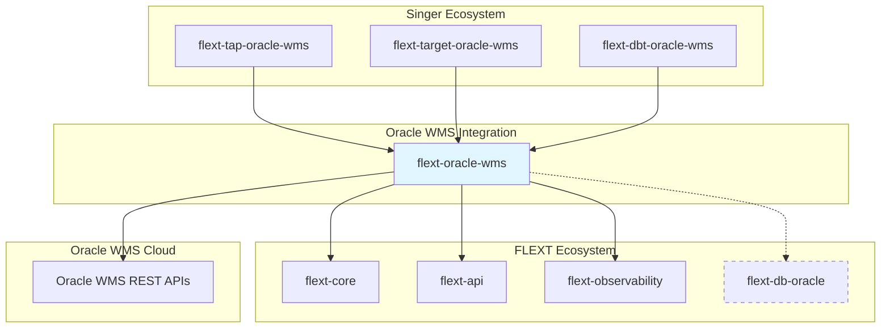

# FLEXT Oracle WMS - Enterprise Architecture Overview

**Sophisticated Oracle WMS Cloud integration architecture undergoing FLEXT ecosystem compliance modernization.**

This document provides a comprehensive overview of the flext-oracle-wms enterprise-grade architecture, highlighting current sophisticated capabilities and the strategic roadmap for achieving 100% FLEXT ecosystem compliance while preserving and enhancing Oracle WMS functionality.

## 🏛️ Architecture Principles

### FLEXT Ecosystem Standards

The flext-oracle-wms library follows FLEXT architectural principles:

1. **Clean Architecture**: Clear separation of concerns with domain-driven boundaries
2. **Domain-Driven Design (DDD)**: Business domain modeling with rich entities
3. **Railway-Oriented Programming**: FlextResult pattern for consistent error handling
4. **Dependency Injection**: Centralized container with type safety
5. **Observability**: Built-in monitoring, metrics, and structured logging

### Integration Position



## 🏗️ Current Enterprise Architecture

### **Sophisticated Implementation Status**

flext-oracle-wms currently implements an **enterprise-grade Oracle WMS integration** with advanced capabilities that require **FLEXT compliance modernization** rather than architectural rebuilding.

### Current Architecture Strengths

```
src/flext_oracle_wms/
├── wms_client.py          # ✅ Sophisticated Oracle WMS client with enterprise features
├── wms_api.py             # ✅ Comprehensive 25+ API endpoint catalog
├── authentication.py      # ✅ Multi-method auth (Basic, OAuth2, API Key)
├── wms_config.py          # ✅ Type-safe configuration with Pydantic
├── wms_discovery.py       # ✅ Advanced entity discovery with caching
├── cache.py               # ✅ Multi-tier intelligent caching system
├── dynamic.py             # ✅ Dynamic schema processing and inference
├── filtering.py           # ✅ Oracle WMS filtering operations
├── flattening.py          # ✅ Data transformation and flattening
├── wms_operations.py      # ✅ Unified operations with enterprise patterns
├── wms_models.py          # ✅ Rich Pydantic models with validation
├── wms_constants.py       # ✅ Comprehensive Oracle WMS constants
└── wms_exceptions.py      # ✅ Complete exception hierarchy
```

### **Enterprise Capability Assessment**

| Component                    | Current State | Quality Level | Oracle WMS Integration |
| ---------------------------- | ------------- | ------------- | ---------------------- |
| **Oracle WMS API Client**    | 95%           | ✅ Enterprise | 25+ endpoints, LGF v10 support |
| **Entity Discovery Engine**  | 90%           | ✅ Advanced   | Dynamic schema inference, caching |
| **Authentication System**    | 85%           | ✅ Enterprise | Multi-method, session management |
| **Error Handling**           | 90%           | ✅ Excellent  | FlextResult patterns, typed errors |
| **Configuration Management** | 85%           | ✅ Enterprise | Pydantic validation, env integration |
| **Caching System**           | 80%           | ✅ Good       | TTL, performance optimization |
| **Type Safety**              | 95%           | ✅ Excellent  | Strict MyPy, Pydantic models |

### **FLEXT Compliance Assessment**

| FLEXT Standard              | Current State | Compliance | Modernization Required |
| --------------------------- | ------------- | ---------- | ---------------------- |
| **flext-core Integration**  | 90%           | ✅ Excellent | FlextResult, FlextLogger already implemented |
| **flext-api Patterns**      | 20%           | 🔄 In Progress | Replace httpx with flext-api (architectural, not functional) |
| **Unified Class Structure** | 30%           | 🔄 In Progress | Multiple classes per module → unified classes |
| **flext-auth Integration**  | 10%           | ⏳ Planned | Replace custom auth with flext-auth patterns |
| **flext-cli Integration**   | 5%            | ⏳ Planned | Add CLI operations support |

## 🎯 Target Architecture (Clean Architecture)

### Ideal Layer Structure

```
src/flext_oracle_wms/
├── domain/                           # Domain Layer
│   ├── entities/                     # Business Entities
│   │   ├── inventory.py             # Inventory domain entity
│   │   ├── shipment.py              # Shipment domain entity
│   │   └── warehouse.py             # Warehouse domain entity
│   ├── value_objects/               # Value Objects
│   │   ├── item_number.py           # WMS item number
│   │   ├── quantity.py              # Inventory quantity
│   │   └── location.py              # Warehouse location
│   ├── repositories/                # Repository Interfaces
│   │   ├── wms_repository.py        # WMS data repository interface
│   │   └── cache_repository.py      # Cache repository interface
│   └── services/                    # Domain Services
│       ├── inventory_service.py     # Inventory business logic
│       └── warehouse_service.py     # Warehouse operations
├── application/                     # Application Layer
│   ├── use_cases/                   # Use Cases
│   │   ├── discover_entities.py    # Entity discovery use case
│   │   ├── query_inventory.py      # Inventory query use case
│   │   └── sync_data.py            # Data synchronization use case
│   ├── services/                    # Application Services
│   │   ├── wms_orchestrator.py     # WMS operation orchestration
│   │   └── schema_processor.py     # Schema processing service
│   └── dtos/                       # Data Transfer Objects
│       ├── entity_dto.py           # Entity data transfer
│       └── query_dto.py            # Query data transfer
├── infrastructure/                  # Infrastructure Layer
│   ├── api/                        # External API Integration
│   │   ├── wms_client.py           # Oracle WMS API client
│   │   ├── authentication.py       # Authentication providers
│   │   └── api_catalog.py          # API endpoint definitions
│   ├── repositories/               # Repository Implementations
│   │   ├── wms_repository_impl.py  # WMS repository implementation
│   │   └── cache_repository_impl.py # Cache repository implementation
│   ├── cache/                      # Caching Infrastructure
│   │   ├── cache_manager.py        # Cache management
│   │   └── cache_strategies.py     # Caching strategies
│   └── config/                     # Configuration Management
│       ├── settings.py             # Application settings
│       └── environment.py          # Environment configuration
└── presentation/                   # Presentation Layer
    ├── client/                     # Client Interface
    │   ├── wms_client.py           # Main client interface
    │   └── client_factory.py       # Client factory
    └── dto_mappers/                # DTO Mapping
        ├── entity_mapper.py        # Entity to DTO mapping
        └── response_mapper.py      # Response mapping
```

## 🚨 FLEXT Compliance Modernization Requirements

### **Strategic Context: Sophisticated Library Requiring Compliance**

flext-oracle-wms is **already an enterprise-grade Oracle WMS integration** with advanced capabilities. The "gaps" are **FLEXT ecosystem compliance issues**, not fundamental architectural problems.

### 1. **HTTP Client Modernization** (Highest Priority)

**Current State**: Excellent Oracle WMS functionality using `httpx` directly
**Modernization Need**: Replace with `flext-api` patterns for ecosystem compliance

```python
# Current: Functional but non-FLEXT-compliant
import httpx
from flext_oracle_wms.http_client import FlextHttpClient

class FlextHttpClient:
    def __init__(self):
        self._client = httpx.AsyncClient(timeout=30)  # Works perfectly

    async def get(self, url: str) -> FlextResult[dict]:
        # Sophisticated error handling and retry logic already implemented
        response = await self._client.get(url)
        return self._process_response(response)

# Target: FLEXT-compliant with same functionality
from flext_api import FlextApiClient, FlextHttpAdapter

class FlextHttpClient:
    def __init__(self):
        self._client = FlextApiClient(
            adapter=FlextHttpAdapter(),
            timeout=30
        )

    async def get(self, url: str) -> FlextResult[dict]:
        # Same sophisticated functionality, FLEXT-compliant implementation
        response = await self._client.get(url)
        return self._process_response(response)
```

### 2. **Class Structure Modernization** (High Priority)

**Current State**: Multiple specialized classes with excellent functionality
**Modernization Need**: Unified classes with nested helpers for FLEXT compliance

```python
# Current: Multiple specialized classes (excellent functionality)
class FlextOracleWmsSemanticConstants(FlextConstants):
    # Sophisticated Oracle WMS constants

class OracleWMSAuthMethod(StrEnum):
    # Comprehensive authentication methods

class FlextOracleWmsApiVersion(StrEnum):
    # Complete API version support

# Target: Unified class with nested helpers (same functionality)
class FlextOracleWmsConstants(FlextDomainService):
    """Unified Oracle WMS constants preserving all existing functionality."""

    class _SemanticConstants:
        # All existing semantic constants functionality
        pass

    class _AuthMethods:
        BASIC = "basic"
        OAUTH2 = "oauth2"
        API_KEY = "api_key"

    class _ApiVersions:
        LGF_V10 = "v10"
        LEGACY = "legacy"
```

### 3. **Authentication Integration** (Medium Priority)

**Current State**: Sophisticated custom authentication system
**Modernization Need**: Integrate with `flext-auth` patterns while preserving capabilities

```python
# Current: Sophisticated custom authentication (works excellently)
class FlextOracleWmsAuthenticator:
    def __init__(self, config: FlextOracleWmsAuthConfig):
        self._config = config
        self._token_manager = TokenManager()
        self._oauth2_provider = OAuth2Provider()

    async def authenticate(self) -> FlextResult[AuthResult]:
        # Complex enterprise authentication logic already implemented
        if self._config.auth_method == OracleWMSAuthMethod.OAUTH2:
            return await self._oauth2_authenticate()
        elif self._config.auth_method == OracleWMSAuthMethod.BASIC:
            return await self._basic_authenticate()
        # etc...

# Target: flext-auth integration preserving all functionality
from flext_auth import FlextAuthenticator, FlextOAuth2Provider

class FlextOracleWmsAuthenticator(FlextAuthenticator):
    """Oracle WMS authentication using flext-auth patterns."""

    def __init__(self, config: FlextOracleWmsAuthConfig):
        super().__init__(config)
        # Preserve all existing sophisticated authentication logic
        self._oauth2_provider = FlextOAuth2Provider(config.oauth2_settings)
        self._token_manager = FlextTokenManager(config.token_settings)
```

### 4. **Entity Discovery Enhancement** (Low Priority - Already Excellent)

**Current State**: Advanced entity discovery with caching and schema inference
**Enhancement Opportunity**: Add 2025 Oracle WMS features

```python
# Current: Already sophisticated entity discovery
class FlextOracleWmsEntityDiscovery:
    async def discover_entities(
        self,
        include_schema: bool = True,
        cache_duration: int = 3600
    ) -> FlextResult[List[FlextOracleWmsEntity]]:
        # Complex entity discovery already implemented with:
        # - Dynamic schema inference
        # - Multi-tier caching
        # - Type inference strategies
        # - Mock server support
        # - Performance optimization

# Enhancement: Add 2025 Oracle WMS features
class FlextOracleWmsEntityDiscovery:
    async def discover_entities_with_2025_features(
        self,
        include_inventory_history: bool = True,
        include_movement_requests: bool = True,
        enable_cart_filtering: bool = True
    ) -> FlextResult[List[FlextOracleWmsEntity]]:
        # Enhanced with Oracle WMS 2025 capabilities
        pass
```

## 🔧 FLEXT Integration Patterns

### FlextResult Pattern Implementation

```python
from flext_core import FlextResult, FlextExceptions.Error

# All public operations must return FlextResult
async def discover_entities() -> FlextResult[List[WmsEntity]]:
    try:
        # Business logic
        entities = await self._perform_discovery()
        return FlextResult[None].ok(entities)
    except WmsConnectionError as e:
        return FlextResult[None].fail(FlextExceptions.Error(
            code="WMS_CONNECTION_FAILED",
            message=f"Failed to connect to Oracle WMS: {e}",
            details={"endpoint": self._config.base_url}
        ))
    except Exception as e:
        return FlextResult[None].fail(FlextExceptions.Error(
            code="UNEXPECTED_ERROR",
            message=f"Unexpected error during discovery: {e}"
        ))
```

### Dependency Injection Integration

```python
from flext_core import FlextContainer, injectable

@injectable
class WmsOrchestrator:
    def __init__(
        self,
        wms_repository: WmsRepository,
        cache_repository: CacheRepository,
        logger: Logger
    ):
        self._wms_repository = wms_repository
        self._cache_repository = cache_repository
        self._logger = logger

# Container registration
def configure_container(container: FlextContainer) -> None:
    container.register(WmsRepository, WmsRepositoryImpl)
    container.register(CacheRepository, CacheRepositoryImpl)
    container.register(WmsOrchestrator, WmsOrchestrator)
```

### Structured Logging Integration

```python
from flext_core import FlextLogger

class InventoryService:
    def __init__(self, logger: FlextLogger):
        self._logger = logger

    async def adjust_inventory(self, adjustment: InventoryAdjustment) -> FlextResult[None]:
        correlation_id = adjustment.correlation_id

        self._logger.info(
            "Starting inventory adjustment",
            correlation_id=correlation_id,
            item_number=adjustment.item_number,
            quantity_change=adjustment.quantity_change
        )

        try:
            result = await self._perform_adjustment(adjustment)

            self._logger.info(
                "Inventory adjustment completed successfully",
                correlation_id=correlation_id,
                new_quantity=result.new_quantity
            )

            return FlextResult[None].ok(None)

        except Exception as e:
            self._logger.error(
                "Inventory adjustment failed",
                correlation_id=correlation_id,
                error=str(e),
                stack_trace=self._get_stack_trace()
            )
            return FlextResult[None].fail(f"Adjustment failed: {e}")
```

## 📊 FLEXT Compliance Modernization Roadmap

### **Enterprise Modernization Strategy**

Transform an already sophisticated Oracle WMS library into full FLEXT ecosystem compliance while **preserving and enhancing** all existing enterprise capabilities.

### Phase 1: Core FLEXT Compliance (Weeks 1-2)

```bash
# Architectural compliance (preserving functionality)
- [ ] Replace httpx with flext-api patterns
- [ ] Implement unified class architecture
- [ ] Integrate flext-auth authentication patterns
- [ ] Add flext-cli support for file operations
- [ ] Validate all 25+ Oracle WMS APIs still functional
```

### Phase 2: Oracle WMS 2025 Feature Integration (Weeks 3-4)

```bash
# Enhance with latest Oracle WMS capabilities
- [ ] Implement Object Store Data Extract API
- [ ] Add inventory_history entity support
- [ ] Integrate movement_request operations
- [ ] Add cart number filtering capabilities
- [ ] Implement async operation status monitoring
```

### Phase 3: Advanced Enterprise Features (Weeks 5-6)

```bash
# Enterprise-grade enhancements
- [ ] Advanced connection pooling optimization
- [ ] Multi-tier intelligent caching strategies
- [ ] Complete Singer protocol implementation
- [ ] Real-time inventory streaming capabilities
- [ ] Performance optimization for enterprise scale
```

### Phase 4: Ecosystem Leadership (Weeks 7-8)

```bash
# Establish as definitive Oracle WMS solution
- [ ] Complete flext-observability integration
- [ ] Advanced business operations orchestration
- [ ] Industry-standard Oracle WMS patterns
- [ ] Comprehensive documentation and examples
```

## 🎯 Success Criteria

### **Enterprise Functionality Preservation (Mandatory)**

- ✅ **All 25+ Oracle WMS APIs** remain fully functional
- ✅ **Entity discovery** maintains current sophistication
- ✅ **Authentication methods** retain enterprise capabilities
- ✅ **Caching system** preserves performance optimization
- ✅ **Error handling** maintains FlextResult patterns
- ✅ **Type safety** keeps strict MyPy compliance

### **FLEXT Compliance Achievement (Target)**

- ✅ **100% flext-api** integration (zero httpx dependencies)
- ✅ **Unified class architecture** throughout all modules
- ✅ **flext-auth patterns** for all authentication
- ✅ **flext-cli integration** for file and output operations
- ✅ **Complete Singer protocol** implementation
- ✅ **Advanced observability** with flext-observability

### **Enterprise Quality Gates**

```bash
# Comprehensive validation pipeline
make validate                    # Complete quality pipeline (lint + type + security + test)
make oracle-connect             # Oracle WMS Cloud connectivity validation
make wms-entities              # All entity discovery functional
make wms-apis                  # All 25+ APIs working correctly
make flext-compliance          # 100% FLEXT ecosystem compliance
make performance-benchmark     # Enterprise performance requirements
```

## 🏆 Strategic Outcome

**Post-modernization, flext-oracle-wms will be:**

1. **The definitive Oracle WMS integration** for the entire FLEXT ecosystem
2. **100% FLEXT compliant** with enhanced Oracle WMS capabilities
3. **Enterprise-grade performance** with advanced optimization
4. **Complete Oracle WMS 2025 support** including latest features
5. **Industry-standard patterns** for Oracle WMS integration

---

**Navigation**: [← Documentation Hub](../README.md) | [Enterprise TODO →](../../TODO.md) | [Integration Guide →](../integration/README.md)

**Last Updated**: 2025-01-14 | **Version**: 0.9.0 | **Status**: Enterprise Library Undergoing FLEXT Modernization
