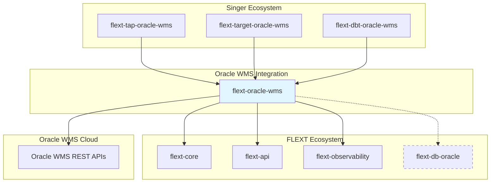

# FLEXT Oracle WMS Architecture Overview

**Clean Architecture implementation for Oracle WMS Cloud integration within the FLEXT ecosystem.**

This document provides a comprehensive overview of the flext-oracle-wms architecture, including current implementation, identified gaps, and remediation roadmap aligned with FLEXT ecosystem standards.

## 🏛️ Architecture Principles

### FLEXT Ecosystem Standards

The flext-oracle-wms library follows FLEXT architectural principles:

1. **Clean Architecture**: Clear separation of concerns with domain-driven boundaries
2. **Domain-Driven Design (DDD)**: Business domain modeling with rich entities
3. **Railway-Oriented Programming**: FlextResult pattern for consistent error handling
4. **Dependency Injection**: Centralized container with type safety
5. **Observability**: Built-in monitoring, metrics, and structured logging

### Integration Position



## 🏗️ Current Architecture Implementation

### Layer Structure

```
src/flext_oracle_wms/
├── client.py              # 🔄 API Client (Infrastructure + Application mixed)
├── api_catalog.py         # ✅ Infrastructure Layer
├── authentication.py      # ✅ Infrastructure Layer
├── config.py             # ✅ Infrastructure Layer
├── discovery.py          # 🔄 Application + Infrastructure mixed
├── cache.py              # ✅ Infrastructure Layer
├── dynamic.py            # 🔄 Application Layer
├── filtering.py          # 🔄 Application Layer
├── flattening.py         # 🔄 Application Layer
├── helpers.py            # ✅ Infrastructure Layer
├── models.py             # ⚠️  Anemic Domain Models
├── types.py              # ✅ Domain Layer
├── constants.py          # ✅ Domain Layer
└── exceptions.py         # ✅ Domain Layer
```

**Legend**: ✅ Correct | 🔄 Mixed Concerns | ⚠️ Needs Enhancement

### Architecture Assessment

| Layer              | Current State | Compliance | Issues                                |
| ------------------ | ------------- | ---------- | ------------------------------------- |
| **Domain**         | 40%           | ⚠️ Partial | Anemic models, missing business logic |
| **Application**    | 30%           | ❌ Poor    | Mixed with infrastructure concerns    |
| **Infrastructure** | 80%           | ✅ Good    | Well-separated technical concerns     |
| **Presentation**   | 60%           | 🔄 Mixed   | Client interface needs separation     |

## 🎯 Target Architecture (Clean Architecture)

### Ideal Layer Structure

```
src/flext_oracle_wms/
├── domain/                           # Domain Layer
│   ├── entities/                     # Business Entities
│   │   ├── inventory.py             # Inventory domain entity
│   │   ├── shipment.py              # Shipment domain entity
│   │   └── warehouse.py             # Warehouse domain entity
│   ├── value_objects/               # Value Objects
│   │   ├── item_number.py           # WMS item number
│   │   ├── quantity.py              # Inventory quantity
│   │   └── location.py              # Warehouse location
│   ├── repositories/                # Repository Interfaces
│   │   ├── wms_repository.py        # WMS data repository interface
│   │   └── cache_repository.py      # Cache repository interface
│   └── services/                    # Domain Services
│       ├── inventory_service.py     # Inventory business logic
│       └── warehouse_service.py     # Warehouse operations
├── application/                     # Application Layer
│   ├── use_cases/                   # Use Cases
│   │   ├── discover_entities.py    # Entity discovery use case
│   │   ├── query_inventory.py      # Inventory query use case
│   │   └── sync_data.py            # Data synchronization use case
│   ├── services/                    # Application Services
│   │   ├── wms_orchestrator.py     # WMS operation orchestration
│   │   └── schema_processor.py     # Schema processing service
│   └── dtos/                       # Data Transfer Objects
│       ├── entity_dto.py           # Entity data transfer
│       └── query_dto.py            # Query data transfer
├── infrastructure/                  # Infrastructure Layer
│   ├── api/                        # External API Integration
│   │   ├── wms_client.py           # Oracle WMS API client
│   │   ├── authentication.py       # Authentication providers
│   │   └── api_catalog.py          # API endpoint definitions
│   ├── repositories/               # Repository Implementations
│   │   ├── wms_repository_impl.py  # WMS repository implementation
│   │   └── cache_repository_impl.py # Cache repository implementation
│   ├── cache/                      # Caching Infrastructure
│   │   ├── cache_manager.py        # Cache management
│   │   └── cache_strategies.py     # Caching strategies
│   └── config/                     # Configuration Management
│       ├── settings.py             # Application settings
│       └── environment.py          # Environment configuration
└── presentation/                   # Presentation Layer
    ├── client/                     # Client Interface
    │   ├── wms_client.py           # Main client interface
    │   └── client_factory.py       # Client factory
    └── dto_mappers/                # DTO Mapping
        ├── entity_mapper.py        # Entity to DTO mapping
        └── response_mapper.py      # Response mapping
```

## 🚨 Critical Architecture Gaps

### 1. **Domain Layer Violations** (Critical)

**Current Problem**: Anemic domain model with missing business behaviors

```python
# Current: Anemic Domain Model
@dataclass
class InventoryItem:
    item_number: str
    quantity: int
    location: str
    # No business behaviors!

# Target: Rich Domain Entity
class InventoryItem(WmsEntity):
    def __init__(self, item_number: ItemNumber, quantity: Quantity, location: Location):
        self._item_number = item_number
        self._quantity = quantity
        self._location = location

    def adjust_quantity(self, adjustment: QuantityAdjustment) -> FlextResult[None]:
        """Business logic for inventory adjustments."""
        if not self._can_adjust(adjustment):
            return FlextResult[None].fail("Invalid quantity adjustment")

        self._quantity = self._quantity.adjust(adjustment)
        self._record_adjustment_event(adjustment)
        return FlextResult[None].ok(None)

    def can_fulfill_order(self, required_quantity: Quantity) -> bool:
        """Domain business rule for order fulfillment."""
        return self._quantity.available >= required_quantity.value
```

### 2. **Application Layer Missing** (Critical)

**Current Problem**: Business use cases mixed with infrastructure

```python
# Current: Mixed Concerns in Client
class FlextOracleWmsClient:
    async def discover_entities(self):
        # Infrastructure + Application + Domain mixed!
        http_response = await self._http_client.get("/entities")  # Infrastructure
        entities = self._process_response(http_response)          # Application
        validated_entities = self._validate_entities(entities)   # Domain
        return FlextResult[None].ok(validated_entities)

# Target: Proper Use Case Separation
class DiscoverEntitiesUseCase:
    def __init__(self, wms_repository: WmsRepository, logger: Logger):
        self._wms_repository = wms_repository
        self._logger = logger

    async def execute(self, request: DiscoverEntitiesRequest) -> FlextResult[List[WmsEntity]]:
        """Pure application logic."""
        self._logger.info("Starting entity discovery", correlation_id=request.correlation_id)

        result = await self._wms_repository.discover_entities()
        if result.is_failure:
            return result

        entities = result.data
        validated_entities = [entity for entity in entities if entity.is_valid()]

        self._logger.info(f"Discovered {len(validated_entities)} valid entities")
        return FlextResult[None].ok(validated_entities)
```

### 3. **Infrastructure Coupling** (High)

**Current Problem**: Direct Oracle API calls without abstraction

```python
# Current: Direct API Coupling
class FlextOracleWmsClient:
    async def get_inventory_data(self, entity_name: str):
        # Direct coupling to Oracle WMS API!
        url = f"{self.base_url}/wms/rest/v1/{entity_name}"
        response = await self._http_client.get(url)
        return self._process_response(response)

# Target: Repository Pattern with Abstraction
class WmsRepositoryImpl(WmsRepository):
    def __init__(self, api_client: OracleWmsApiClient):
        self._api_client = api_client

    async def get_inventory_data(self, query: InventoryQuery) -> FlextResult[List[InventoryItem]]:
        """Repository implementation with proper abstraction."""
        api_result = await self._api_client.query_entity(
            entity_name=query.entity_name,
            filters=query.to_api_filters()
        )

        if api_result.is_failure:
            return FlextResult[None].fail(f"API query failed: {api_result.error}")

        # Map API response to domain entities
        inventory_items = [
            InventoryItem.from_api_data(item_data)
            for item_data in api_result.data
        ]

        return FlextResult[None].ok(inventory_items)
```

## 🔧 FLEXT Integration Patterns

### FlextResult Pattern Implementation

```python
from flext_core import FlextResult, FlextError

# All public operations must return FlextResult
async def discover_entities() -> FlextResult[List[WmsEntity]]:
    try:
        # Business logic
        entities = await self._perform_discovery()
        return FlextResult[None].ok(entities)
    except WmsConnectionError as e:
        return FlextResult[None].fail(FlextError(
            code="WMS_CONNECTION_FAILED",
            message=f"Failed to connect to Oracle WMS: {e}",
            details={"endpoint": self._config.base_url}
        ))
    except Exception as e:
        return FlextResult[None].fail(FlextError(
            code="UNEXPECTED_ERROR",
            message=f"Unexpected error during discovery: {e}"
        ))
```

### Dependency Injection Integration

```python
from flext_core import FlextContainer, injectable

@injectable
class WmsOrchestrator:
    def __init__(
        self,
        wms_repository: WmsRepository,
        cache_repository: CacheRepository,
        logger: Logger
    ):
        self._wms_repository = wms_repository
        self._cache_repository = cache_repository
        self._logger = logger

# Container registration
def configure_container(container: FlextContainer) -> None:
    container.register(WmsRepository, WmsRepositoryImpl)
    container.register(CacheRepository, CacheRepositoryImpl)
    container.register(WmsOrchestrator, WmsOrchestrator)
```

### Structured Logging Integration

```python
from flext_core import FlextLogger

class InventoryService:
    def __init__(self, logger: FlextLogger):
        self._logger = logger

    async def adjust_inventory(self, adjustment: InventoryAdjustment) -> FlextResult[None]:
        correlation_id = adjustment.correlation_id

        self._logger.info(
            "Starting inventory adjustment",
            correlation_id=correlation_id,
            item_number=adjustment.item_number,
            quantity_change=adjustment.quantity_change
        )

        try:
            result = await self._perform_adjustment(adjustment)

            self._logger.info(
                "Inventory adjustment completed successfully",
                correlation_id=correlation_id,
                new_quantity=result.new_quantity
            )

            return FlextResult[None].ok(None)

        except Exception as e:
            self._logger.error(
                "Inventory adjustment failed",
                correlation_id=correlation_id,
                error=str(e),
                stack_trace=self._get_stack_trace()
            )
            return FlextResult[None].fail(f"Adjustment failed: {e}")
```

## 📊 Architecture Compliance Roadmap

### Phase 1: Foundation (Weeks 1-2)

```bash
# Critical infrastructure setup
- [ ] Integrate flext-db-oracle dependency
- [ ] Implement proper repository pattern
- [ ] Create domain entity base classes
- [ ] Establish FlextResult consistency
```

### Phase 2: Domain Modeling (Weeks 3-4)

```bash
# Rich domain model implementation
- [ ] Create WMS domain entities (Inventory, Shipment, etc.)
- [ ] Implement value objects (ItemNumber, Quantity, Location)
- [ ] Add business behaviors to domain entities
- [ ] Create domain services for complex operations
```

### Phase 3: Application Layer (Weeks 5-6)

```bash
# Use case and application service implementation
- [ ] Create use case classes for major operations
- [ ] Implement application services for orchestration
- [ ] Add DTOs for data transfer
- [ ] Separate application logic from infrastructure
```

### Phase 4: Integration (Weeks 7-8)

```bash
# FLEXT ecosystem integration completion
- [ ] Complete Singer protocol implementation
- [ ] Add flext-observability monitoring
- [ ] Implement dependency injection patterns
- [ ] Add comprehensive structured logging
```

## 🎯 Success Criteria

### Architecture Compliance Metrics

- **Domain Layer**: 90%+ pure business logic
- **Application Layer**: 100% use case implementation
- **Infrastructure Layer**: Complete abstraction from domain
- **FlextResult Usage**: 100% consistency in public API
- **Dependency Injection**: Full integration with flext-core container

### Quality Gates

```bash
# All must pass before architecture completion
make validate                    # Code quality and testing
make architecture-compliance     # Architectural pattern validation
make flext-integration-test     # FLEXT ecosystem integration
make performance-benchmark      # Performance requirements
```

---

**Navigation**: [← Documentation Hub](../README.md) | [API Design →](api-design.md) | [Integration Patterns →](integration-patterns.md)

**Last Updated**: 2025-01-04 | **Version**: 0.9.0 | **Status**: Architecture Remediation Required
