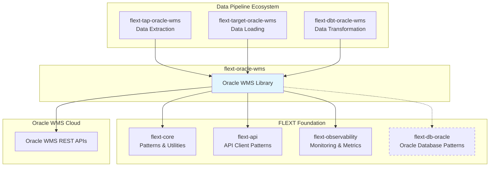

# FLEXT Ecosystem Integration Guide

**Comprehensive integration patterns for flext-oracle-wms within the FLEXT data integration platform.**

This guide details how flext-oracle-wms integrates with FLEXT foundation libraries, data pipeline components, and enterprise patterns to provide seamless Oracle WMS Cloud connectivity.

## 🏗️ Ecosystem Overview

### FLEXT Foundation Integration



## 🎯 flext-core Integration

### FlextResult Pattern Implementation

**Current State**: 85% compliance, needs consistency improvements

```python
from flext_core import FlextResult, FlextError
from flext_oracle_wms import FlextOracleWmsClient

# ✅ Correct Usage - All public methods return FlextResult
async def discover_wms_entities() -> FlextResult[List[WmsEntity]]:
    client = FlextOracleWmsClient(config)

    # All operations return FlextResult for consistent error handling
    result = await client.discover_entities()

    if result.success:
        entities = result.data
        print(f"Discovered {len(entities)} WMS entities")
        return FlextResult[None].ok(entities)
    else:
        # Handle errors consistently
        error = FlextError(
            code="WMS_DISCOVERY_FAILED",
            message=f"Failed to discover entities: {result.error}",
            details={"base_url": config.base_url}
        )
        return FlextResult[None].fail(error)

# ❌ Current Issue - Some methods bypass FlextResult
# This pattern exists in current codebase and needs fixing
def legacy_method():
    # Directly returns data without FlextResult wrapper
    return {"status": "success", "data": []}  # Should return FlextResult!
```

### Dependency Injection Integration

**Gap**: Missing flext-core DI container integration

```python
from flext_core import FlextContainer, injectable, singleton

# Target: Proper DI Integration
@injectable
@singleton
class WmsService:
    def __init__(
        self,
        wms_client: FlextOracleWmsClient,
        cache_manager: CacheManager,
        logger: FlextLogger
    ):
        self._client = wms_client
        self._cache = cache_manager
        self._logger = logger

# Container Configuration
def configure_wms_container(container: FlextContainer) -> None:
    # Register WMS-specific services
    container.register(FlextOracleWmsClient, FlextOracleWmsClient)
    container.register(CacheManager, WmsCacheManager)
    container.register(WmsService, WmsService)

    # Configure with factory pattern
    container.register_factory(
        FlextOracleWmsClient,
        lambda: create_wms_client_from_environment()
    )

# Usage with DI
async def main():
    container = FlextContainer()
    configure_wms_container(container)

    # Automatic dependency injection
    wms_service = container.resolve(WmsService)
    result = await wms_service.discover_entities()
```

### Structured Logging Integration

**Current State**: Partial integration, needs enhancement

```python
from flext_core import FlextLogger, LogContext

class WmsOperations:
    def __init__(self, logger: FlextLogger):
        self._logger = logger

    async def sync_inventory_data(self, request: SyncRequest) -> FlextResult[SyncResult]:
        # Create correlation context for request tracing
        context = LogContext(
            correlation_id=request.correlation_id,
            operation="inventory_sync",
            entity_name=request.entity_name
        )

        with self._logger.context(context):
            self._logger.info("Starting inventory synchronization")

            try:
                # Perform synchronization
                result = await self._perform_sync(request)

                self._logger.info(
                    "Inventory synchronization completed",
                    records_processed=result.records_processed,
                    duration_ms=result.duration_ms
                )

                return FlextResult[None].ok(result)

            except Exception as e:
                self._logger.error(
                    "Inventory synchronization failed",
                    error=str(e),
                    stack_trace=self._get_stack_trace()
                )
                return FlextResult[None].fail(f"Sync failed: {e}")
```

## 🔌 flext-api Integration

### Enterprise API Client Patterns

**Current State**: Good foundation, needs enhancement

```python
from flext_api import EnterpriseApiClient, ApiClientConfig, RetryPolicy
from flext_oracle_wms.authentication import FlextOracleWmsAuthenticator

# Current: Basic HTTP client implementation
class FlextOracleWmsClient:
    def __init__(self, config: FlextOracleWmsClientConfig):
        # Custom HTTP client implementation
        self._http_client = httpx.AsyncClient(
            base_url=config.base_url,
            timeout=config.timeout
        )

# Target: flext-api integration
class FlextOracleWmsClient(EnterpriseApiClient):
    def __init__(self, config: FlextOracleWmsClientConfig):
        api_config = ApiClientConfig(
            base_url=config.base_url,
            timeout=config.timeout,
            retry_policy=RetryPolicy(
                max_retries=config.max_retries,
                backoff_strategy="exponential"
            ),
            authentication=FlextOracleWmsAuthenticator(config)
        )
        super().__init__(api_config)

    async def discover_entities(self) -> FlextResult[List[WmsEntity]]:
        # Inherit enterprise patterns: retries, circuit breaker, metrics
        response = await self.get("/entities", track_metrics=True)

        if response.success:
            entities = self._parse_entities(response.data)
            return FlextResult[None].ok(entities)
        else:
            return FlextResult[None].fail(f"Discovery failed: {response.error}")
```

### Authentication Provider Integration

```python
from flext_api import AuthenticationProvider, BearerTokenAuth, ApiKeyAuth
from flext_oracle_wms.authentication import FlextOracleWmsAuthenticator

# Enhanced authentication with flext-api patterns
class OracleWmsAuthProvider(AuthenticationProvider):
    def __init__(self, config: FlextOracleWmsClientConfig):
        self._config = config
        self._auth_cache = {}

    async def get_authentication(self) -> Dict[str, str]:
        """Get authentication headers for Oracle WMS."""
        if self._config.auth_method == "bearer":
            token = await self._get_cached_token()
            return {"Authorization": f"Bearer {token}"}
        elif self._config.auth_method == "api_key":
            return {"X-API-Key": self._config.api_key}
        else:
            # Basic authentication
            credentials = base64.b64encode(
                f"{self._config.username}:{self._config.password}".encode()
            ).decode()
            return {"Authorization": f"Basic {credentials}"}

    async def refresh_authentication(self) -> bool:
        """Refresh authentication tokens if needed."""
        if self._config.auth_method == "bearer":
            return await self._refresh_bearer_token()
        return True
```

## 📊 flext-observability Integration

### Metrics and Monitoring

**Gap**: Missing comprehensive observability integration

```python
from flext_observability import (
    FlextMetrics,
    FlextTracing,
    HealthCheck,
    monitor_function,
    trace_async_function
)

@monitor_function("wms_entity_discovery")
@trace_async_function
async def discover_entities_with_monitoring(
    client: FlextOracleWmsClient
) -> FlextResult[List[WmsEntity]]:
    """Automatically monitored and traced WMS operation."""

    # Metrics automatically collected:
    # - wms_entity_discovery.duration
    # - wms_entity_discovery.success_rate
    # - wms_entity_discovery.error_rate

    result = await client.discover_entities()

    # Custom metrics
    FlextMetrics.increment("wms.entities.discovered", len(result.data))
    FlextMetrics.histogram("wms.api.response_time", result.duration_ms)

    return result

# Health Check Integration
class WmsHealthCheck(HealthCheck):
    def __init__(self, client: FlextOracleWmsClient):
        self._client = client
        super().__init__(name="oracle_wms", timeout=30)

    async def check_health(self) -> Dict[str, Any]:
        """Check Oracle WMS connectivity and status."""
        try:
            # Test basic connectivity
            result = await self._client.health_check()

            return {
                "status": "healthy" if result.success else "unhealthy",
                "connection": "ok",
                "api_version": result.data.get("version"),
                "response_time_ms": result.duration_ms
            }
        except Exception as e:
            return {
                "status": "unhealthy",
                "error": str(e),
                "connection": "failed"
            }
```

### Distributed Tracing

```python
from flext_observability import FlextTracing, SpanContext

class WmsService:
    def __init__(self, client: FlextOracleWmsClient, tracer: FlextTracing):
        self._client = client
        self._tracer = tracer

    async def sync_inventory_with_tracing(
        self,
        request: SyncRequest,
        parent_context: SpanContext = None
    ) -> FlextResult[SyncResult]:

        with self._tracer.start_span(
            "wms_inventory_sync",
            parent_context=parent_context
        ) as span:
            # Add span attributes
            span.set_attribute("wms.entity", request.entity_name)
            span.set_attribute("wms.operation", "inventory_sync")
            span.set_attribute("wms.base_url", self._client.base_url)

            try:
                # Trace entity discovery
                with self._tracer.start_span("wms_discover_entities", parent=span) as discovery_span:
                    entities_result = await self._client.discover_entities()
                    discovery_span.set_attribute("entities.count", len(entities_result.data))

                # Trace data synchronization
                with self._tracer.start_span("wms_sync_data", parent=span) as sync_span:
                    sync_result = await self._perform_data_sync(request, entities_result.data)
                    sync_span.set_attribute("records.processed", sync_result.records_processed)

                span.set_status("ok")
                return FlextResult[None].ok(sync_result)

            except Exception as e:
                span.set_status("error", str(e))
                span.record_exception(e)
                return FlextResult[None].fail(f"Sync failed: {e}")
```

## 🚨 Critical Integration Gaps

### 1. **Missing flext-db-oracle Integration** (Critical)

**Problem**: Duplicates Oracle database patterns instead of reusing ecosystem libraries

```python
# Current: Custom Oracle connection handling
class FlextOracleWmsClient:
    def __init__(self, config):
        # Custom Oracle connection - DUPLICATES flext-db-oracle patterns!
        self._connection_string = f"oracle://{config.username}:{config.password}@{config.host}"

# Target: flext-db-oracle integration
from flext_db_oracle import OracleConnection, OracleRepository

class WmsOracleRepository(OracleRepository):
    def __init__(self, connection: OracleConnection):
        super().__init__(connection)

    async def get_wms_entities(self) -> FlextResult[List[WmsEntity]]:
        """Use flext-db-oracle patterns for Oracle connectivity."""
        query = """
        SELECT entity_name, entity_type, schema_definition
        FROM wms_entities
        WHERE active = 1
        """

        result = await self.execute_query(query, WmsEntity)
        return result
```

### 2. **Incomplete Singer Integration** (Critical)

**Problem**: Limited Singer protocol implementation for data pipelines

```python
# Current: Basic factory implementation
def create_oracle_wms_client():
    return FlextOracleWmsClient(config)

# Target: Complete Singer integration
from singer import Catalog, Stream, Schema
from flext_oracle_wms import FlextOracleWmsClient

async def generate_singer_catalog(client: FlextOracleWmsClient) -> Catalog:
    """Generate complete Singer catalog for WMS entities."""

    entities_result = await client.discover_entities()
    if entities_result.is_failure:
        raise Exception(f"Failed to discover entities: {entities_result.error}")

    streams = []
    for entity in entities_result.data:
        schema_result = await client.get_entity_schema(entity.name)
        if schema_result.success:
            schema = Schema.from_dict(schema_result.data)
            stream = Stream(
                tap_stream_id=entity.name,
                schema=schema,
                table_name=entity.name,
                metadata=entity.metadata
            )
            streams.append(stream)

    return Catalog(streams=streams)

# Real-time streaming capability
async def stream_wms_changes(
    client: FlextOracleWmsClient,
    entity_name: str
) -> AsyncIterator[Dict[str, Any]]:
    """Stream real-time WMS entity changes."""

    last_sync_time = await client.get_last_sync_time(entity_name)

    while True:
        changes_result = await client.get_entity_changes(
            entity_name,
            since=last_sync_time
        )

        if changes_result.success:
            for change in changes_result.data:
                yield {
                    "type": "RECORD",
                    "record": change.data,
                    "stream": entity_name,
                    "time_extracted": change.timestamp.isoformat()
                }
                last_sync_time = change.timestamp

        await asyncio.sleep(30)  # Poll every 30 seconds
```

## 🎯 Integration Roadmap

### Phase 1: Foundation Integration (Weeks 1-2)

```bash
# Critical foundation integrations
- [ ] Integrate flext-db-oracle for Oracle connections
- [ ] Implement 100% FlextResult pattern compliance
- [ ] Add flext-core dependency injection support
- [ ] Enhance structured logging with flext-core patterns
```

### Phase 2: Enterprise API Integration (Weeks 3-4)

```bash
# flext-api integration enhancement
- [ ] Extend EnterpriseApiClient base class
- [ ] Implement enterprise authentication patterns
- [ ] Add connection pooling and circuit breaker patterns
- [ ] Integrate request/response middleware
```

### Phase 3: Observability Integration (Weeks 5-6)

```bash
# Comprehensive monitoring and tracing
- [ ] Add flext-observability metrics collection
- [ ] Implement distributed tracing for all operations
- [ ] Create comprehensive health checks
- [ ] Add performance monitoring and alerting
```

### Phase 4: Singer Protocol Completion (Weeks 7-8)

```bash
# Complete data pipeline integration
- [ ] Implement complete Singer catalog generation
- [ ] Add real-time streaming capabilities
- [ ] Create tap/target integration patterns
- [ ] Add DBT model generation support
```

## ✅ Success Criteria

### Integration Compliance Metrics

- **flext-core Integration**: 100% FlextResult usage, full DI support
- **flext-api Integration**: Enterprise client patterns, authentication
- **flext-observability**: Comprehensive metrics, tracing, health checks
- **flext-db-oracle**: Shared Oracle patterns, no duplication
- **Singer Protocol**: Complete catalog generation, streaming support

### Quality Gates

```bash
# All must pass for integration completion
make validate                      # Code quality and testing
make flext-integration-test       # FLEXT ecosystem integration tests
make singer-protocol-test         # Singer protocol compliance
make observability-test           # Monitoring and metrics validation
```

---

**Navigation**: [← Architecture Overview](../architecture/README.md) | [Singer Protocol →](singer-protocol.md) | [Oracle Database →](oracle-database.md)

**Last Updated**: 2025-01-04 | **Version**: 1.0.0 | **Status**: Critical Integration Gaps Identified
